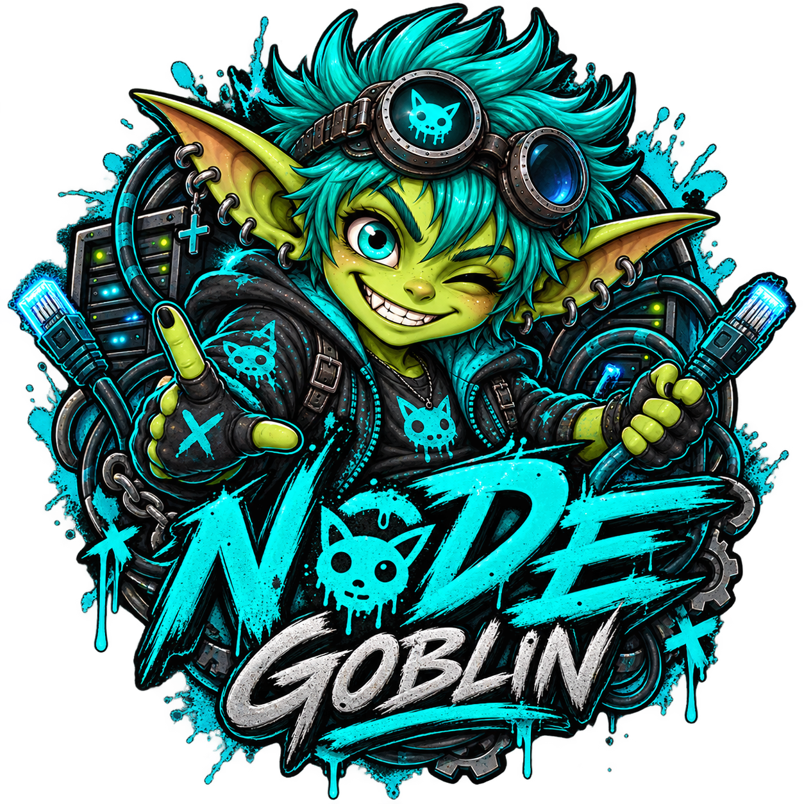

# Node Goblin

<p align="center">
  
</p>

Node Goblin is the Burrow mod for connecting and managing additional Burrow nodes.

This repository also contains **Mini Node Goblin**, the small host runtime that runs on a node and connects back to Burrow. “Mini” is only a differentiator; it does not describe a separate protocol or implementation.

## Install the mod

Install the mod into the `mods` directory of a Burrow runtime:

```bash
BURROW_RUNTIME_ROOT="${BURROW_RUNTIME_ROOT:-${XDG_DATA_HOME:-$HOME/.local/share}/burrow}"
mkdir -p "$BURROW_RUNTIME_ROOT/mods"
git clone https://github.com/NightShaman/Node-Goblin.git \
  "$BURROW_RUNTIME_ROOT/mods/remote-nodes"
```

Restart Burrow after installing or updating the mod.

To update an existing checkout:

```bash
git -C "$BURROW_RUNTIME_ROOT/mods/remote-nodes" pull --ff-only
```

## Mini Node Goblin

Mini Node Goblin runs on the host you want Burrow to reach. Download the latest release from [GitHub Releases](https://github.com/NightShaman/Node-Goblin/releases), or use the files in `gateway/` for local development.

The host deployment scripts are in [`gateway/deploy/`](gateway/deploy/).

## Links

- [Burrow](https://github.com/NightShaman/Burrow)
- [Releases](https://github.com/NightShaman/Node-Goblin/releases)
- [Issues](https://github.com/NightShaman/Node-Goblin/issues)
