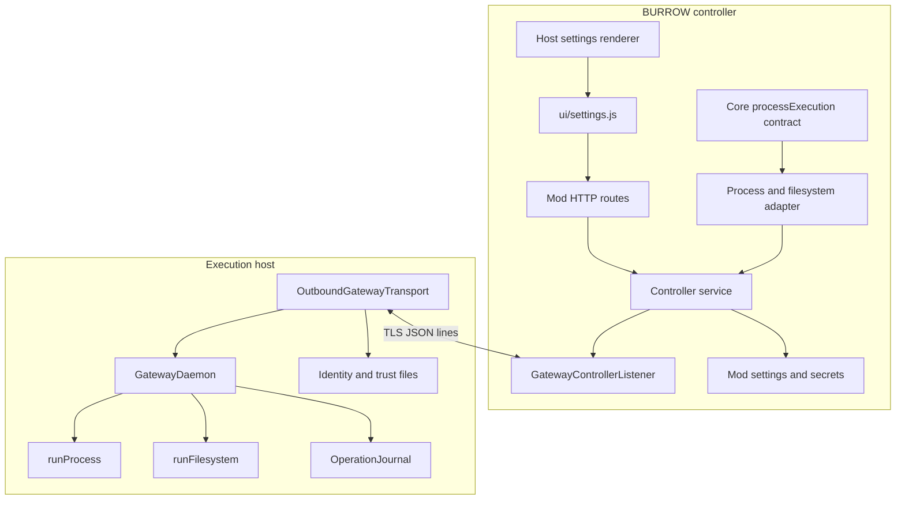
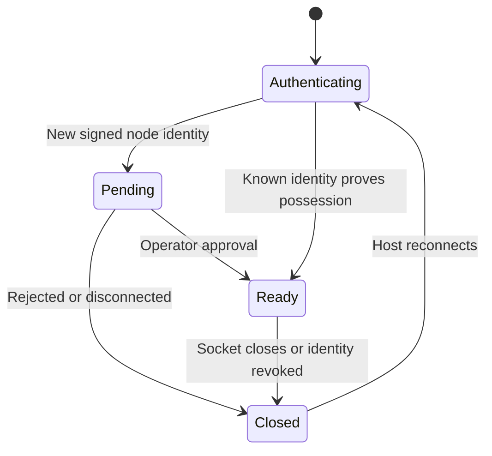

# Architecture

The repository has three runtime components: a BURROW mod server, a settings contribution, and a standalone gateway package. Node Goblin remains an independent mod. Core owns the generic execution-provider contract, agent assignment, host admission, and permission decisions.

## Component map

## Manifest and activation

`burrow.mod.json` declares ID `node-goblin`, system-mod status, `server/index.mjs`, `ui/settings.js`, the API-target contribution, and `execution-provider-v1`. The version appears in the manifest and gateway package/release files.

`activate()` creates or accepts a controller service, registers a Core process controller when `processExecution.registerController` exists, and registers the mod's HTTP routes. Its returned `close()` unregisters the controller and closes the listener.

The adapter exposes `executeProcess(request, { abortSignal })` and `executeNativeFilesystem(request, { abortSignal })`. Core supplies correlated operation IDs and target IDs. The target ID becomes the gateway ID. Process results are translated into the `shell_exec` result shape; filesystem results preserve their tool result and add remote execution provenance.

The Core process adapter forwards the execution form (`command` or `executable`/`args`), `cwd`, `env`, `timeoutMs`, and supported protected-value/binding inputs. It does not forward the wire protocol's `deadlineMs` or `maxOutputBytes` options in this baseline. Direct HTTP process dispatch and direct protocol callers have a different option surface; do not assume every wire option is available through the Core adapter.

## Controller service

The service reads listener settings, gateway trust records, pairing identity, and TLS secrets. It generates missing controller pairing keys and, when enabled, missing TLS material. It wraps the TLS listener with persistence and route-facing state.

Pairing approval first stores the trusted public key and gateway record, removes the pending record, and then commits the live approval. Persistence failures attempt rollback. Stored pending requests alone are informational after restart; the live nonce must match.

## Connection and execution lifecycle

The host transport reconnects with exponential backoff from 100 ms to a maximum 5 seconds. Authentication success resets the attempt counter. A disconnected controller rejects pending dispatch promises with `gateway_disconnected`; that is uncertainty about execution completion, not a rollback.

The daemon validates a request, checks completed replay and active-operation state, sends `accepted`, runs the operation, stores terminal evidence in the journal, then sends the final response. A duplicate active ID returns `operation_in_progress`; a reused ID with a different digest returns `operation_id_conflict`.

## Persistence ownership

| Owner | Stored data | Purpose |
| --- | --- | --- |
| BURROW mod settings | Controller config, API targets, gateway metadata, pending pairings, TLS metadata, operation correlation | Controller-side configuration and correlation |
| BURROW mod secrets | TLS private material, pairing identity, trusted public keys, HMAC secrets | Credential/identity storage supplied by the host |
| Gateway state directory | Node identity, controller trust/pins, enrollment-consumed marker, current pairing code, completed operations | Durable host identity and bounded replay |
| Listener memory | Active connections, pending requests, bounded activity | Current connection/dispatch bookkeeping |

Core storage implementation and encryption guarantees are outside this repository. Back up the Core-owned secrets store with its required keys, not just the mod's visible settings. See [configuration](configuration.md) for names and paths.

## Source references

- [`burrow.mod.json`](https://github.com/NightShaman/Node-Goblin/blob/12d0f1daf74516e1f0120c80ad4716bd09e1dead/burrow.mod.json)
- [`server/index.mjs`](https://github.com/NightShaman/Node-Goblin/blob/12d0f1daf74516e1f0120c80ad4716bd09e1dead/server/index.mjs)
- [`gateway/lib/controller-listener.mjs`](https://github.com/NightShaman/Node-Goblin/blob/12d0f1daf74516e1f0120c80ad4716bd09e1dead/gateway/lib/controller-listener.mjs)
- [`gateway/lib/daemon.mjs`](https://github.com/NightShaman/Node-Goblin/blob/12d0f1daf74516e1f0120c80ad4716bd09e1dead/gateway/lib/daemon.mjs)
