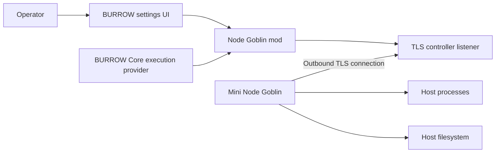

# Node Goblin

Node Goblin connects a BURROW controller to additional execution hosts. Install the **Node Goblin mod** in BURROW and **Mini Node Goblin** on each host that will execute work. Mini is the host-side part of the same implementation and protocol.

These pages cover the operator workflow, the developer contracts, and the behavior present in source release **2026.09.27**. They describe the repository, not the state of a deployed host. The [source map](source-map.md) identifies the exact baseline and ownership boundaries.

## Start here

| Goal | Read |
| --- | --- |
| Add a remote Linux host | [Install](installation.md), then [pair and assign](pairing.md) |
| Understand the settings screen | [Settings guide](settings.md) |
| Diagnose a disconnected gateway | [Operations and recovery](operations.md) |
| Configure ports, files, limits, and trust | [Configuration](configuration.md) and [security](security.md) |
| Integrate or extend the mod | [Architecture](architecture.md), [HTTP API](api.md), and [wire protocol](protocol.md) |
| Contribute safely | [Development](development.md) |

## What runs where

The gateway opens the outbound connection. The controller sends operations over that established connection. It does not need to SSH into the host. Core owns agent assignments and permission decisions; Node Goblin supplies the execution transport and host implementation.

!!! warning "Host access is real access"
    Operations run with the operating-system permissions of the gateway service account. Pair only hosts and controllers you trust, limit network exposure, and choose a least-privileged account and workspace. A workspace path is not an operating-system sandbox.

## Two kinds of targets

The `/targets` collection stores named HTTP(S) API targets. A paired gateway identity is a separate object used by remote process and filesystem execution. Adding an API target does not install, pair, or authorize a gateway. For agent assignments, use an approved gateway ID and `providerId: node-goblin`.

## Project links

- [Repository](https://github.com/NightShaman/Node-Goblin)
- [Release assets](https://github.com/NightShaman/Node-Goblin/releases)
- [Issue tracker](https://github.com/NightShaman/Node-Goblin/issues)
- [BURROW](https://github.com/NightShaman/Burrow)

This documentation is source documentation. A proposed Pages workflow is included, but a successful local build or pull request does not mean a public Pages deployment exists.

## Source references

- [`README.md`](https://github.com/NightShaman/Node-Goblin/blob/12d0f1daf74516e1f0120c80ad4716bd09e1dead/README.md)
- [`burrow.mod.json`](https://github.com/NightShaman/Node-Goblin/blob/12d0f1daf74516e1f0120c80ad4716bd09e1dead/burrow.mod.json)
