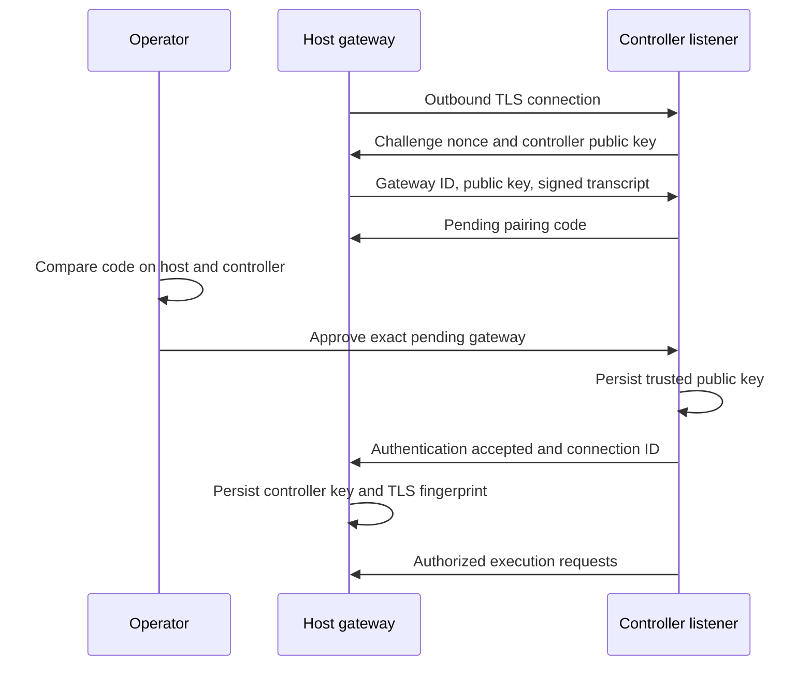

# Pairing and agent assignment

Pairing establishes permission for a controller to execute on a host. Treat approval as a host-access decision. A successful TLS socket or a visible pending gateway is not approval.

## First connection with key pairing



1. Configure the controller and restart BURROW after listener/TLS changes.
2. Configure and start the host as described in [installation](installation.md).
3. Read the current code using `sudo node-goblin pairing-code` on the host.
4. In **Pending pairings**, locate the same gateway ID and compare the displayed code through an independently trusted channel.
5. Approve only the intended host. Approval enables host execution. Reject unexpected requests.
6. Confirm the gateway appears approved and connected, then perform a harmless test in a disposable workspace.

The node creates an Ed25519 keypair in `node-identity.json`. The transcript binds the nonce, gateway ID, node public key, and controller public key. The displayed code is 12 hexadecimal characters grouped as `XXXX-XXXX-XXXX`. An unpaired node without an explicit CA temporarily permits an unauthenticated TLS channel for bootstrap. For controlled networks, provision `BURROW_GATEWAY_CA_FILE` before the first connection so standard TLS verification also applies from the outset.

After initial key pairing, the node persists the controller public key and certificate fingerprint. A changed controller key/certificate is not automatically accepted. Plan certificate replacement and re-pairing rather than treating a mismatch as a transient connectivity problem.

## Pending and restored requests

Pending request records can survive a controller restart for visibility, but approval requires the matching live connection and nonce. Wait for the node to reconnect and verify its current code. This release does not assign a pairing-expiry timestamp; the UI may show a dash for expiry. Do not interpret that display as an expiry guarantee.

## Legacy shared-secret enrollment

The repository also supports HMAC enrollment for existing deployments:

- Register the gateway ID and shared secret through the protected BURROW settings interface. Leave the controller ID as `controller` for a new packaged CLI enrollment: that CLI uses this fixed default and exposes no controller-ID environment setting. Programmatic enrollment can use another controller ID only when the host's stored trust and controller record agree.
- Restart BURROW after saving HMAC trust so the listener loads it.
- Provision the same enrollment token out of band in the host's protected environment file, never in a command argument or URL.
- Provide appropriate TLS CA trust for the controller. HMAC enrollment does not use the key-pairing bootstrap exception.
- Verify successful authentication, then remove the bootstrap token from the environment file. New HMAC trust is saved when enrollment is initialized; the running first-enrollment transport records consumption on authentication. Explicit host unpairing also records consumption.

`controller-trust.json` retains the shared secret for subsequent authentication. An existing trust file takes precedence over a changed enrollment token, so editing the environment token alone does not rotate that saved credential. “One-time enrollment” does not mean that file contains no reusable credential. New key-paired deployments and existing HMAC deployments have different trust state; do not assume changing a UI field migrates between methods. Coordinate any migration with a backup and a verified unpair/re-pair procedure.

## Assign an agent

In **Agent assignments**:

1. Choose **Configured gateway**.
2. Select the approved gateway ID.
3. Enter an absolute workspace root on that host.
4. Save the assignment.

The UI sends a Core-owned agent update shaped as:

```json
{
  "executionEnvironment": {
    "kind": "remote",
    "providerId": "node-goblin",
    "targetId": "worker-01",
    "workspaceRoot": "/srv/burrow/workspaces/example"
  }
}
```

Assignments apply to future turns. Core owns when and how an assignment is admitted; the model does not select a different host mid-turn through this UI. An absolute workspace is a location, not confinement of process or filesystem access.

To return an agent to the controller, choose **Local controller** and an absolute local workspace, then save. The local assignment omits provider and target IDs.

## Revoke and unpair

Controller-side **Revoke** removes the persisted gateway record and secrets and asks the listener to remove/disconnect that identity. Follow the returned restart guidance. A socket disconnect is not evidence that already-started host processes have stopped; inspect and stop them separately when required.

Host-side `sudo node-goblin unpair` stops the service, removes controller trust and pairing-code state, removes controller pins from the preserved node identity, and records enrollment consumption. It preserves the node's keypair and operation journal. Configure the intended controller, reconnect, and compare a new code.

Do not clone the same durable node identity onto several concurrently running hosts. Give each host its own state directory and stable gateway ID.

## Source references

- [`gateway/lib/pairing.mjs`](https://github.com/NightShaman/Node-Goblin/blob/12d0f1daf74516e1f0120c80ad4716bd09e1dead/gateway/lib/pairing.mjs)
- [`gateway/lib/network-transport.mjs`](https://github.com/NightShaman/Node-Goblin/blob/12d0f1daf74516e1f0120c80ad4716bd09e1dead/gateway/lib/network-transport.mjs)
- [`gateway/lib/controller-listener.mjs`](https://github.com/NightShaman/Node-Goblin/blob/12d0f1daf74516e1f0120c80ad4716bd09e1dead/gateway/lib/controller-listener.mjs)
- [`server/index.mjs`](https://github.com/NightShaman/Node-Goblin/blob/12d0f1daf74516e1f0120c80ad4716bd09e1dead/server/index.mjs)
- [`ui/settings.js`](https://github.com/NightShaman/Node-Goblin/blob/12d0f1daf74516e1f0120c80ad4716bd09e1dead/ui/settings.js)
- [`gateway/deploy/node-goblin`](https://github.com/NightShaman/Node-Goblin/blob/12d0f1daf74516e1f0120c80ad4716bd09e1dead/gateway/deploy/node-goblin)
