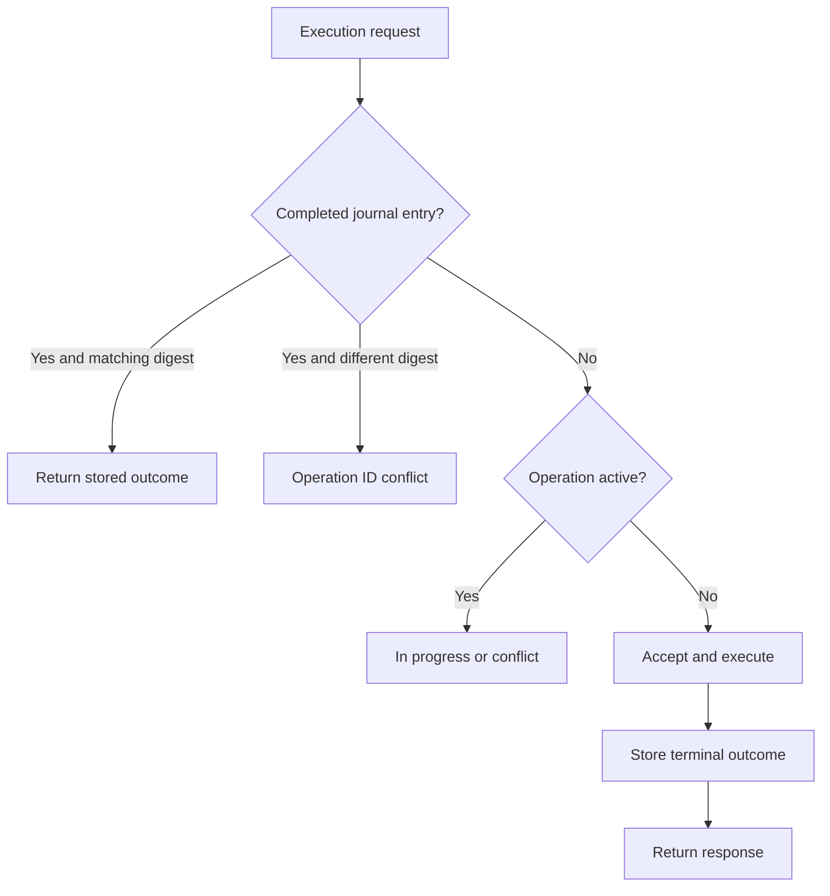

# Wire protocol and process execution

*On narrow screens, swipe tables horizontally to see every column.*

The daemon accepts one JSON request per line and emits JSON lines. Protocol version is `1.0`. It can run over local stdio or over the authenticated outbound TLS connection. These are application envelopes rather than a claim of JSON-RPC compatibility.

## Request and response shapes

```json
{"id":"request-1","method":"hello","params":{}}
```

```json
{"type":"response","requestId":"request-1","ok":true,"result":{"name":"burrow-host-gateway","protocolVersion":"1.0","transport":"stdio-jsonl"}}
```

`requestId` correlates a transport request. `operationId` identifies execution for deduplication/replay and must be kept stable across a safe retry of the same operation. They serve different purposes.

| Method | Parameters | Result |
| --- | --- | --- |
| `hello` | None | Name, implementation version, protocol version, transport |
| `health` | None | Status and active operation IDs |
| `process.exec` | Operation ID and process options | Accepted envelope, stream/terminal events, terminal response |
| `filesystem.execute` | Operation ID, tool, arguments | Accepted envelope and terminal filesystem result |
| `cancel` | `operationId` | `{operationId, cancelling}`; cancellation request is not terminal evidence |
| `shutdown` | None | Idle-daemon administrative/development stop; complete active operations first |

Malformed JSON produces an `invalid_json` protocol error. Unsupported methods produce `unknown_method`. Network authentication messages are handled by the transport before daemon dispatch.

Use `shutdown` only after active operations have completed. For packaged deployments, use the systemd service lifecycle to stop the daemon; do not rely on this protocol method to drain or cancel active work.

## Process options

Choose exactly one execution form:

```json
{"operationId":"demo-001","executable":"node","args":["-e","console.log('hello')"],"cwd":"/srv/burrow/workspaces/example","timeoutMs":30000}
```

or a shell command string. `command` uses `shell: true`; `executable` with string `args` uses `shell: false`. A command cannot also supply an executable or a nonempty args array.

| Option | Behavior |
| --- | --- |
| `cwd` | Requested working directory; otherwise daemon working directory |
| `env` | String-coerced environment additions over the daemon environment |
| `timeoutMs` | Positive integer; default 30,000 ms |
| `deadlineMs` | Optional absolute deadline using the supplied clock |
| `maxOutputBytes` | Positive integer; combined captured stdout/stderr cap, default 1 MiB; overflow truncates capture and sends SIGTERM to the process/group |
| `operationId` | Explicit identifier; daemon can derive a hash when absent, but controller HTTP execution requires it |
| `protectedBindingMetadata` | Safe binding metadata retained for digest/correlation |
| `protectedValues` and `protectedDelivery` | Internal authenticated one-shot delivery; not ordinary persisted request data |

Do not interpolate untrusted text into a shell command. Prefer explicit executable/argument arrays when shell syntax is unnecessary.

These are daemon protocol options. The [Core adapter](architecture.md#manifest-and-activation) forwards a narrower subset and does not forward `deadlineMs` or `maxOutputBytes` in this baseline. Output overflow sends SIGTERM; it does not by itself schedule the one-second SIGKILL escalation used for cancellation and timeouts.

## Events and terminal evidence

An `accepted` envelope includes the operation ID and protocol version. `process.stream` events include stream (`stdout` or `stderr`), sequence, data, and truncation state. `process.terminal` includes process evidence: timestamps, duration, working directory, effective UID/GID, hostname, execution form, exit code/signal, cancellation/timeout flags, captured output, and output digests.

A successful transport response does not imply process success. Inspect `exitCode`, `timedOut`, `cancelled`, `signal`, and truncation. The Core adapter treats exit code zero with neither cancellation nor timeout as a successful shell tool result.

On POSIX, child processes start detached and termination targets the process group. Cancellation and timeout first send SIGTERM, then attempt SIGKILL after one second, with a fallback settlement timer. This is process lifecycle management, not full containment of processes that escape the group.

## Protected values

Only process execution accepts protected values. The daemon checks valid environment names and nonempty string values and binds delivery to gateway ID, connection ID, request ID, and operation ID supplied by the authenticated transport. Protected environment values override ordinary environment entries. Literal matching values are redacted from stdout/stderr stream data and captured terminal stdout/stderr before journal/transport accumulation. This does not redact command, argument, or working-directory metadata and is not general data-loss prevention for transformed or encoded secrets.

One-shot protected values and delivery bindings are excluded from the canonical request digest and journal input. A replay attempt that resends protected values returns `protected_redelivery_forbidden`. Do not build an automatic retry that blindly re-delivers credentials.

## Replay guarantees and limits

<div class="diagram-scroll" role="region" tabindex="0" aria-label="Scrollable architecture diagram" markdown="1">



</div>

*On narrow screens, scroll the diagram horizontally to read all labels.*

The journal defaults to five minutes and 256 completed operations. Entries are expired/evicted, so ID reuse outside that retained window can execute again. Only completed outcomes are journaled. A crash between side effects and journal persistence leaves an ambiguous result. The implementation therefore provides bounded completed-operation replay, not a universal exactly-once guarantee.

Before retrying a mutating operation after uncertainty, inspect host-side effects. Reuse the same operation ID only with an unchanged request and an understood replay window.

## Stdio development example

```bash
printf '%s
' '{"id":"hello-1","method":"hello","params":{}}'   | node gateway/cli.mjs
```

Do not use this example with a controller URL already set in the environment: that switches the CLI into network mode. `GatewayClient` provides a local child-process helper for requests and collected execution events; callers still own process lifetime and error handling.

## Source references

- [`gateway/lib/protocol.mjs`](https://github.com/NightShaman/Node-Goblin/blob/12d0f1daf74516e1f0120c80ad4716bd09e1dead/gateway/lib/protocol.mjs)
- [`gateway/lib/daemon.mjs`](https://github.com/NightShaman/Node-Goblin/blob/12d0f1daf74516e1f0120c80ad4716bd09e1dead/gateway/lib/daemon.mjs)
- [`gateway/lib/process-runner.mjs`](https://github.com/NightShaman/Node-Goblin/blob/12d0f1daf74516e1f0120c80ad4716bd09e1dead/gateway/lib/process-runner.mjs)
- [`gateway/lib/journal.mjs`](https://github.com/NightShaman/Node-Goblin/blob/12d0f1daf74516e1f0120c80ad4716bd09e1dead/gateway/lib/journal.mjs)
- [`gateway/lib/client.mjs`](https://github.com/NightShaman/Node-Goblin/blob/12d0f1daf74516e1f0120c80ad4716bd09e1dead/gateway/lib/client.mjs)
- [`server/index.mjs`](https://github.com/NightShaman/Node-Goblin/blob/12d0f1daf74516e1f0120c80ad4716bd09e1dead/server/index.mjs)
