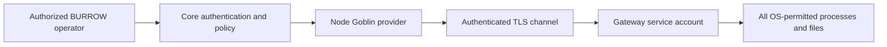

# Security and trust boundaries

Node Goblin deliberately enables remote host execution. Its trust model depends on a protected BURROW controller, correct host enrollment, encrypted transport, and least-privileged host permissions.

## Boundaries

Core decides who may configure and use the provider. The mod manages gateway identity and routes execution. The gateway executes with its account's permissions. It does not introduce a container, VM, chroot, or mandatory filesystem allowlist.

## Deployment checklist

- Keep BURROW's administrative HTTP surface authenticated and restricted.
- Expose the controller TLS listener only to networks/hosts that need it.
- Prefer explicit TLS CA provisioning before initial pairing where possible.
- Compare the pairing code over an independent trusted channel before approval.
- Run the gateway as a dedicated low-privilege user; inspect any adopted existing account.
- Give the account access only to the intended workspaces and programs.
- Protect state, config, TLS files, controller secrets, and backups.
- Separate gateway identities across hosts; do not clone private identity state.
- Test revocation, re-pairing, cancellation, and uncertain-operation recovery before critical workloads.
- Treat arbitrary shell command execution as a powerful capability; prefer executable/args interfaces for structured input.

## TLS and identity

The outbound transport has two application identity paths: approved Ed25519 pairing and legacy HMAC challenge response. Normal key pairing persists the controller public key and TLS certificate fingerprint. HMAC enrollment stores reusable trust in the host state directory.

The first key-pairing connection without an explicit CA uses a bootstrap TLS exception. Pairing-code comparison is essential in that workflow. An explicit CA adds transport authentication from the first connection. Never resolve a mismatch by disabling validation without understanding which identity changed and why.

Supplying `ca`, `cert`, and `key` options does not by itself prove that the controller requires mutual TLS; review its actual TLS server configuration. Application-layer gateway identity is the implemented admission mechanism.

## Secret handling

Protected execution values are transient, connection/request/operation-bound, and excluded from persisted request digests. Literal secret values are redacted from stdout/stderr stream data and captured terminal stdout/stderr before journaling. Command, argument, and working-directory metadata are separate evidence fields; do not place secrets there. Redaction does not cover transformed secrets, arbitrary ordinary environment values, files, or unrelated sensitive process output.

The runtime inherits the service process environment and overlays requested ordinary/protected environment values. Keep the daemon environment minimal and remove bootstrap tokens after enrollment. Audit what programs can read under the service account.

The gateway journal can retain process evidence, including ordinary output and command metadata, and filesystem results. Protect it as potentially sensitive data even when protected-value redaction worked.

## Availability and resource policy

Default timeouts, output limits, replay retention, and traversal budgets reduce routine resource use. They are not an external resource sandbox. Some bounds can be overridden by callers and file reads/searches are buffered. Choose reasonable request limits, storage quotas, operating-system controls, and monitoring for the deployment.

## Reporting an issue

Do not post credentials, private outputs, or a live exploitation transcript in a public issue. Share a minimal sanitized reproduction and affected commit through an appropriate maintainer channel. This page describes operational boundaries; it is not a penetration-test certificate or a guarantee that all security defects have been eliminated.

## Source references

- [`gateway/lib/network-transport.mjs`](https://github.com/NightShaman/Node-Goblin/blob/12d0f1daf74516e1f0120c80ad4716bd09e1dead/gateway/lib/network-transport.mjs)
- [`gateway/lib/controller-listener.mjs`](https://github.com/NightShaman/Node-Goblin/blob/12d0f1daf74516e1f0120c80ad4716bd09e1dead/gateway/lib/controller-listener.mjs)
- [`gateway/lib/process-runner.mjs`](https://github.com/NightShaman/Node-Goblin/blob/12d0f1daf74516e1f0120c80ad4716bd09e1dead/gateway/lib/process-runner.mjs)
- [`gateway/lib/filesystem-runner.mjs`](https://github.com/NightShaman/Node-Goblin/blob/12d0f1daf74516e1f0120c80ad4716bd09e1dead/gateway/lib/filesystem-runner.mjs)
- [`gateway/deploy/burrow-host-gateway.service`](https://github.com/NightShaman/Node-Goblin/blob/12d0f1daf74516e1f0120c80ad4716bd09e1dead/gateway/deploy/burrow-host-gateway.service)
